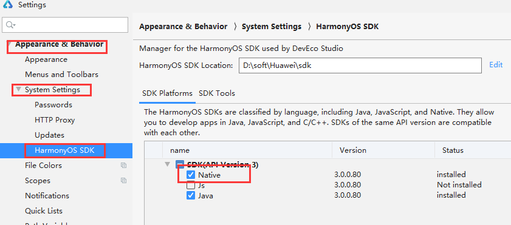

# 鸿蒙NDK开发

## 1. 序言

就像开发Android要用Android Studio一样，Android Studio（简称AS）其实是基于IDEA+gradle插件+android插件开发而来。

鸿蒙系统，你可以认为它和android有点像，但又是超越android的存在，除了手机，还可以其他各种设备。。然后，我们需要一个对标Android Studio的开发工具。那就是DevEco Studio了。

Android Studio是一个IDE，基于gradle执行构建，应用层写Java/Kotlin，NDK层则可以用C/C++开发。

DevEco Studio也是一个IDE，基于gradle执行构建，应用层写Java/JS，NDK层可以用C/C++开发。

总之，NDK层，大家都是C/C++写代码，基于CMake构建。如果你是搞NDK开发的，应该知道这一点：把编译器和cmake的toolchain文件配置好，不用IDE就可以开发了。

Android NDK可以手动从官网下载；但是鸿蒙NDK似乎没法从官网直接下载，需要在DevEco Studio中下载。


## 1. 安装DevEco Studio以及NDK

官网说明文档：

https://developer.harmonyos.com/cn/docs/documentation/doc-guides/software_install-0000001053582415

要点：
1. 注册华为账号，邮箱或手机号

2. 下载DevEco Studio安装包

3. File->Settings->Appearance & Behavior->System Settings->HarmonyOS SDK，勾选Native安装



安装时可以手动改Sdk安装位置，默认在C盘，我改为了`D:\soft\Huawei\sdk`，只要不是在DevEco Studio安装目录里面都可以。

4. gradle代理

遇到的问题是，连接到huaweicloud的gradle相关的下载总是失败。后来发现，由于先前我配置过Android开发环境，配置过gradle代理，需要关掉gradle代理才能让DevEco顺畅下载。即：

`C:\Users\zz\.gradle\gradle.properties`文件，临时改名（回头用Android Studio时改回来）

## 2. OHOS NDK开发（命令行方式）
从鸿蒙的NDK相关的cmake toolchain里面可以发现，鸿蒙开放系统，被简称为了OHOS，估计是Open Harmony Operating System的缩写吧。

OHOS的NDK安装在sdk里面。例如我的：
ohos sdk目录：`D:\soft\Huawei\sdk`;
ohos ndk目录：`D:\soft\Huawei\sdk\native\3.0.0.80`;
ohos ndk的cmake toolchain文件：`D:\soft\Huawei\sdk\native\3.0.0.80\build\cmake\ohos.toolchain.cmake`

到这里，习惯于命令行方式执行交叉编译的工程师们都知道怎么做了。

作为样例，我贴一下我的OHOS NDK的hello world的相关文件：
```cmake
cmake_minimum_required(VERSION 3.15)

set(CMAKE_EXPORT_COMPILE_COMMANDS ON)

project(hello)

add_library(hello STATIC
    ${CMAKE_SOURCE_DIR}/hello.h
    ${CMAKE_SOURCE_DIR}/hello.cpp
)
```

`hello.cpp`
```c++
#include "hello.h"

//#include <stdio>
#include <iostream>

void hello(const char* name)
{
    if (name==NULL) {
        //printf("Hello World\n");
        std::cout << "Hello World\n";
    } else {
        //printf("Hello %s\n", name);
        std::cout << "Hello " << name << "\n";
    }
}
```

`hello.h`
```c++
#ifndef HELLO_H
#define HELLO_H

void hello(const char* name);

#endif
```

`build/ohos-arm64-v8a.bat`
```batch
@echo off

set OHOS_NDK=D:/soft/Huawei/sdk/native/3.0.0.80
set TOOLCHAIN=%OHOS_NDK%/build/cmake/ohos.toolchain.cmake

REM echo "=== TOOLCHAIN is: $TOOLCHAIN"

set BUILD_DIR=ohos-arm64-v8a
if not exist %BUILD_DIR% md %BUILD_DIR%
cd %BUILD_DIR%

cmake -G Ninja ^
    -DCMAKE_TOOLCHAIN_FILE=%TOOLCHAIN% ^
    -DOHOS_ARCH="arm64-v8a" ^
    -DCMAKE_BUILD_TYPE=Debug ^
    ../..

ninja

cd ..
```

这里注意系统中应当先装好了cmake和ninja并且放在了系统PATH中。当然，你也可以用OHOS NDK里面装好的cmake。

在cmd中切换到build目录，执行`ohos-arm64-v8a.bat`，可以生成静态库文件`libhello.a`。


## 3. OHOS NDK开发（IDE模式）

Android Studio中在创建项目的时候可以选择带Native的开发，会生成CMakeLists.txt和相应C++文件。DevEco Studio目前暂时支持的创建项目模板不多，还不能直接生成NDK相关文件。不过手动创建CMakeLists.txt和C++文件，应该还是比较容易的，对于做过NDK开发的人来说没啥问题。

除了CMake和C/C++代码，还需要修改模块的build.gradle文件，让gradle知道怎么调用cmake。官方文档：

https://developer.harmonyos.com/cn/docs/documentation/doc-guides/build_config-0000001052902431


贴一下我的entry模块的build.gradle，其中卡壳的地方是需要手动指定 CMAKE_TOOLCHAIN_FILE 路径。这一点需要DevEco Studio改进（或者是我没有正确配置？如果知道还请指出）：
```groovy
apply plugin: 'com.huawei.ohos.hap'
ohos {
    compileSdkVersion 3
    defaultConfig {
        compatibleSdkVersion 3
    }
    externalNativeBuild {
        path "src/main/cpp/CMakeLists.txt"   //CMake配置入口，提供CMake构建脚本的相对路径
        arguments "-DCMAKE_TOOLCHAIN_FILE=D:/soft/Huawei/sdk/native/3.0.0.80/build/cmake/ohos.toolchain.cmake"    //传递给CMake的可选编译参数
        abiFilters "arm64-v8a"     //用于设置本机的ABI编译环境
        cppFlags ""   //设置C++编译器的可选参数
    }
}

dependencies {
    implementation fileTree(dir: 'libs', include: ['*.jar'])
    testCompile'junit:junit:4.12'
}
```

如果没有指定 OHOS 的 CMAKE_TOOLCHAIN_FILE 文件，会报错说`stdio.h`找不到。
